# ☁️ Intégration Google Drive dans BentoPDF

Ce document détaille la configuration requise, le fonctionnement technique, les choix d'architecture (_pourquoi_) et les diagrammes synoptiques de l'intégration **Google Drive** dans BentoPDF.

---

## 1. Vue d'ensemble & Philosophie (« Pourquoi »)

BentoPDF est un outil de traitement PDF **100% côté client** (Zero-Server / Privacy-First). Tous les traitements cryptographiques, de fusion, de conversion et d'édition s'exécutent localement dans le navigateur de l'utilisateur grâce à WebAssembly et JavaScript.

L'intégration de Google Drive respecte strictement ce principe :

- **Aucun serveur intermédiaire** : BentoPDF ne dispose pas de serveur backend recevant vos fichiers ou vos jetons d'accès.
- **Accès direct Client ↔ Google** : Le navigateur communique directement avec les API Google (`accounts.google.com`, `apis.google.com`, `docs.google.com`, `googleapis.com`).
- **Principe du moindre privilège** :
  - Scope OAuth minimal : `https://www.googleapis.com/auth/drive.file`. BentoPDF n'obtient l'accès qu'aux **seuls fichiers que vous désignez** dans le sélecteur Google Picker — jamais au reste de votre Drive.
  - Pas de droits d'écriture, de modification ni d'effacement sur votre Google Drive.
  - Le jeton d'accès est conservé pour la **durée de l'onglet uniquement** (`sessionStorage`), afin de ne pas
    redemander une connexion à chaque outil — BentoPDF étant une application multi-pages. Il disparaît à la
    fermeture de l'onglet, n'est jamais écrit en `localStorage`, et le bouton **Déconnecter** le révoque
    immédiatement côté Google.
- **Injection transparente dans les outils** : Les fichiers récupérés depuis Drive sont convertis en objets JavaScript standards `File` et injectés dans la zone de dépôt (_Dropzone_) via l'API native `DataTransfer`, déclenchant immédiatement les traitements de l'outil BentoPDF ciblé (fusion, compression, etc.).

---

## 2. Configuration Nécessaire (Google Cloud Console)

Pour activer Google Drive sur votre instance BentoPDF (en local ou auto-hébergée), vous devez disposer d'un projet sur la **Google Cloud Console**.

### Étape 2.1 — Créer un Projet Google Cloud

1. Rendez-vous sur la [Google Cloud Console](https://console.cloud.google.com/).
2. Créez un nouveau projet (ex: `BentoPDF-Drive`).

### Étape 2.2 — Activer les APIs Requises

Dans le menu **APIs et services > Bibliothèque**, recherchez et activez **ces deux APIs** :

1. **Google Drive API** (permet de lister les métadonnées et de télécharger le contenu binaire des fichiers).
2. **Google Picker API** (fournit la boîte de dialogue graphique sécurisée pour naviguer dans vos dossiers Drive).

### Étape 2.3 — Configurer l'Écran de Consentement OAuth

Dans **APIs et services > Écran de consentement OAuth** :

1. Type d'utilisateur : **Externe** (ou **Interne** si vous utilisez Google Workspace).
2. Renseignez le nom de l'application (ex: `BentoPDF`) et votre adresse email d'assistance.
3. **Champs d'application (Scopes)** :
   - Ajoutez le scope : `https://www.googleapis.com/auth/drive.file`.
   - N'ajoutez pas `drive.readonly` : ce scope donne accès à l'intégralité du Drive et n'est pas nécessaire ici.
4. **Utilisateurs tests** :
   - Si votre application est en statut "Test", ajoutez votre adresse email Google personnelle pour vous autoriser à vous connecter.

### Étape 2.4 — Créer les Identifiants (Client ID & Clé API)

Dans **APIs et services > Identifiants** :

#### A. Créer un ID Client OAuth 2.0

1. Cliquez sur **Créer des identifiants > ID client OAuth**.
2. Type d'application : **Application Web**.
3. Nom : `BentoPDF Web Client`.
4. **Origines JavaScript autorisées** :
   - En local : `http://localhost:5173` _(attention : pas de barre oblique `/` finale)_.
   - En production : `https://votre-domaine.com` (votre URL d'accès BentoPDF).
5. Cliquez sur **Créer** et copiez le **Client ID** (ex: `123456789-xxx.apps.googleusercontent.com`).

#### B. Créer une Clé API (API Key)

1. Cliquez sur **Créer des identifiants > Clé API**.
2. Cliquez sur **Modifier la clé** pour sécuriser son utilisation :
   - **Restrictions relatives aux API** : Restreindre la clé aux APIs **Google Drive API** et **Google Picker API**.
3. Copiez la clé API (ex: `AIzaSy...`).

---

## 3. Configuration dans BentoPDF

Vous pouvez renseigner vos identifiants de deux manières :

### Option A — Variables d'Environnement (Recommandé pour Docker & Déploiements)

Dans le fichier `.env` ou lors du lancement de votre conteneur Docker :

```env
VITE_GOOGLE_CLIENT_ID="123456789-xxx.apps.googleusercontent.com"
VITE_GOOGLE_API_KEY="AIzaSyYourApiKeyHere"
VITE_GOOGLE_APP_ID="123456789"
```

Lors de la compilation ou du démarrage du serveur dev, BentoPDF charge ces clés automatiquement.

> **`VITE_GOOGLE_APP_ID` est obligatoire.** C'est le **numéro de projet** Google Cloud
> (le préfixe numérique du Client ID). Le scope `drive.file` n'accorde l'accès qu'aux
> fichiers sélectionnés **via un Picker portant cet App ID** ; sans lui, le téléchargement
> échoue en 404 alors même que la sélection a réussi. L'API **Google Drive** doit être
> activée sur le projet, faute de quoi `docs.google.com` refuse d'afficher le sélecteur.

> **Ces trois valeurs sont publiques.** Vite les inline dans le bundle navigateur : c'est
> attendu pour un identifiant client et une clé d'API. N'y placez jamais un _client secret_
> OAuth (préfixe `GOCSPX-`), il n'a aucun usage dans un flux Drive/Picker côté navigateur.
> Restreignez la clé d'API par **référent HTTP** dans la console Google Cloud.

### Option B — Interface Utilisateur (Stockage Local)

Si aucune variable `.env` n'est définie :

1. Cliquez sur le bouton **Google Drive** présent sur n'importe quel outil ou ouvrez les **Paramètres > Google Drive**.
2. Saisissez votre **Client ID**, votre **Clé API** et votre **App ID** (numéro de projet).
3. Les clés sont enregistrées de façon persistante dans le `localStorage` de votre navigateur.

---

## 4. Architecture Technique du Script (`googleDrive.ts`)

Le module [`src/js/integrations/googleDrive.ts`](src/js/integrations/googleDrive.ts) orchestre l'ensemble du cycle de vie :

```
bentopdf/src/js/integrations/googleDrive.ts
├── 1. Credentials & Settings (Client ID, API Key, localStorage / env)
├── 2. Dynamic Script Loader (GIS: accounts.google.com/gsi/client + GAPI: apis.google.com/js/api.js)
├── 3. OAuth 2.0 GIS Token Client (demande popup, obtention et cache de l'access_token)
├── 4. Google Picker API Builder (affichage du dialogue Drive avec filtres MIME intelligents)
├── 5. File Downloader & Google Docs Exporter (téléchargement direct et conversion PDF)
├── 6. DOM Dropzone Injector (création du DataTransfer et dispatch de l'événement change)
└── 7. UI Button Auto-Injection (scan automatique de toutes les dropzones de la page)
```

### 4.1 Persistance de Session & Connexion Unique Multi-Pages

- **Stockage en sessionStorage** : Le jeton d'accès OAuth 2.0 est conservé en sessionStorage pendant sa durée de vie (~1 heure).
- **Navigation fluide sans reconnexion** : Lorsque vous passez d'un outil à un autre (ex: de la fusion PDF à la conversion EPUB), la session Google Drive reste active. Aucun popup de sélection de compte n'apparaît lors du passage d'une page à une autre.
- **Bouton d'état dans la Navbar** :
  - Un bouton d'authentification direct est accessible depuis la barre supérieure (navbar) de toutes les pages.
  - Dès la connexion effectuée, un indicateur « **Drive connecté** » avec pastille verte s'affiche et vous permet également de vous déconnecter en un clic.
- **Compatibilité formats étendus (EPUB, Office, etc.)** :
  - Pour les outils convertissant des formats non-PDF (ex: EPUB to PDF), le Picker utilise un mapping de types MIME stricts et intègre un onglet « **Tous les fichiers** » pour contourner les cas où Google Drive étiquette un fichier en pplication/octet-stream.

### Détails des Composants Clés :

1. **Chargement Asynchrone à la Demande (`loadGoogleScripts`)** :
   - Les scripts de Google (`gsi/client` et `api.js`) ne sont téléchargés que lorsque l'utilisateur clique pour la première fois sur le bouton Google Drive, préservant ainsi la vitesse de chargement initiale de BentoPDF.

2. **Flux OAuth 2.0 GIS Moderne (`requestGoogleAccessToken`)** :
   - Utilise l'API moderne `google.accounts.oauth2.initTokenClient` de Google (popup sans redirection perturbante).
   - Les jetons sont mis en cache en mémoire pendant leur durée de validité (~1 heure).

3. **Filtres MIME Adaptatifs selon l'Outil** :
   - Le Picker analyse l'attribut `accept` de l'outil BentoPDF actif.
   - Si l'outil n'accepte que les PDF (ex: Fusionner, Compresser, Signer), le Picker filtre automatiquement pour n'afficher que les fichiers PDF et les Google Docs convertibles.
   - Si l'outil traite des images (ex: Image to PDF), le Picker filtre sur les formats JPEG, PNG, WebP, etc.

4. **Export Automatique des Documents Google Workspace** :
   - Si l'utilisateur sélectionne un fichier natif Google Docs, Google Sheets ou Google Slides, le script appelle l'API d'exportation de Google Drive pour convertir le document à la volée en PDF haute fidélité (`application/pdf`).

5. **Gestion de la Sécurité & En-têtes HTTP (`vite.config.ts`)** :
   - `Cross-Origin-Opener-Policy`: réglé sur `same-origin-allow-popups` pour autoriser la fenêtre popup OAuth de Google à communiquer avec l'application hôte.
   - `Cross-Origin-Embedder-Policy` (COEP) : désactivé sur les routes de dev web pour éviter que le navigateur n'interdise à l'iframe `docs.google.com/picker` d'utiliser les cookies d'authentification Google nécessaires à l'affichage des vignettes de documents.
   - `setAppId` : non invoqué par défaut pour éviter le blocage de l'iframe si le Drive SDK n'est pas déployé sur le projet cloud.

---

## 5. Synoptique & Diagrammes de Flux

### A. Architecture Globale

```mermaid
flowchart TD
    subgraph Browser["Navigateur Utilisateur (BentoPDF)"]
        UI["Interface Outil (ex: Merge PDF)"]
        Button["Bouton Google Drive"]
        Module["Module googleDrive.ts"]
        Zone["Dropzone BentoPDF"]
    end

    subgraph GoogleCloud["Infrastructure Google Cloud"]
        GIS["Google Identity Services (OAuth 2.0)"]
        Picker["Google Picker Iframe (docs.google.com)"]
        DriveAPI["Google Drive REST API v3"]
    end

    Button -->|1. Clic| Module
    Module -->|2. Authentification popup| GIS
    GIS -->|3. access_token| Module
    Module -->|4. Initialise avec Clé API + Token| Picker
    Picker -->|5. L'utilisateur choisit un fichier| Module
    Module -->|6. GET /drive/v3/files/{id}?alt=media| DriveAPI
    DriveAPI -->|7. Données binaires Blob/PDF| Module
    Module -->|8. DataTransfer & File object| Zone
    Zone -->|9. Traitement local WebAssembly| UI
```

---

### B. Diagramme de Séquence Détaillé (Sélection & Téléchargement)

```mermaid
sequenceDiagram
    autonumber
    actor User as Utilisateur
    participant BentoUI as BentoPDF (Navigateur)
    participant GDriveModule as googleDrive.ts
    participant GoogleAuth as Google Identity (GIS)
    participant GooglePicker as Google Picker API
    participant DriveAPI as Google Drive API v3

    User->>BentoUI: Clic sur « Google Drive »
    BentoUI->>GDriveModule: openGooglePicker(targetInput)

    rect rgb(30, 41, 59)
        note over GDriveModule,GoogleAuth: Phase d'Authentification OAuth 2.0
        GDriveModule->>GoogleAuth: requestAccessToken()
        GoogleAuth-->>User: Affichage popup consentement Google
        User->>GoogleAuth: Validation du compte & autorisation
        GoogleAuth-->>GDriveModule: access_token (porteur)
    end

    rect rgb(15, 23, 42)
        note over GDriveModule,GooglePicker: Phase de Sélection du Fichier
        GDriveModule->>GooglePicker: new google.picker.PickerBuilder()<br/>.setOAuthToken(token)<br/>.setDeveloperKey(apiKey)
        GDriveModule->>BentoUI: Affichage modal Picker (docs.google.com)
        User->>GooglePicker: Navigation et sélection du/des fichier(s)
        GooglePicker-->>GDriveModule: Callback Action.PICKED avec [docId, name, mimeType]
    end

    rect rgb(30, 41, 59)
        note over GDriveModule,DriveAPI: Phase de Récupération Binaire
        GDriveModule->>BentoUI: showLoader("Downloading file...")
        alt Fichier standard (PDF, image)
            GDriveModule->>DriveAPI: GET https://www.googleapis.com/drive/v3/files/{id}?alt=media
            DriveAPI-->>GDriveModule: Blob binaire du fichier
        else Google Docs / Sheets / Slides
            GDriveModule->>DriveAPI: GET https://www.googleapis.com/drive/v3/files/{id}/export?mimeType=application/pdf
            DriveAPI-->>GDriveModule: Blob PDF converti
        end
        GDriveModule->>GDriveModule: new File([blob], fileName)
        GDriveModule->>BentoUI: injectFilesIntoTarget(files, input)
        GDriveModule->>BentoUI: hideLoader()
    end

    BentoUI-->>User: Le fichier apparaît dans la liste des documents prêts !
```



---

## 6. Résolution des Problèmes Fréquents (Troubleshooting)

| Problème / Message d'erreur                                                    | Cause Racine                                                                                                                                                                                                | Solution                                                                                                                                                                                                                                                                |
| ------------------------------------------------------------------------------ | ----------------------------------------------------------------------------------------------------------------------------------------------------------------------------------------------------------- | ----------------------------------------------------------------------------------------------------------------------------------------------------------------------------------------------------------------------------------------------------------------------- |
| **`docs.google.com a refusé de se connecter`**                                 | • `http://localhost:5173` absent des Origines JS autorisées.<br>• Protection contre le pistage du navigateur bloquant les cookies tiers.<br>• Appel incorrect à `setAppId` ou présence de `DocsUploadView`. | • Ajouter `http://localhost:5173` dans le Client OAuth de la Google Console.<br>• Autoriser les cookies tiers pour `localhost` dans le navigateur.<br>• Utiliser la version du script avec `DocsUploadView` supprimé et `setAppId` réservé aux configurations avancées. |
| **`Google Client ID is not configured`**                                       | Les identifiants sont manquants.                                                                                                                                                                            | Renseigner `VITE_GOOGLE_CLIENT_ID` et `VITE_GOOGLE_API_KEY` dans le fichier `.env` ou via la boîte de dialogue de configuration de BentoPDF.                                                                                                                            |
| **`The origin does not match the authorized JavaScript origins` (Erreur 400)** | L'URL actuelle du navigateur ne figure pas exactement dans la liste de la console Google.                                                                                                                   | Vérifier dans Google Cloud Console > Identifiants > ID Client OAuth Web que l'URL exacte (protocole + domaine + port) est renseignée sans slash de fin.                                                                                                                 |
| **Popup bloquée**                                                              | Le navigateur bloque les popups automatiques.                                                                                                                                                               | Autoriser les fenêtres popups pour le domaine de votre instance BentoPDF.                                                                                                                                                                                               |
